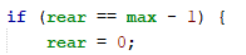

# Laporan Algoritma dan Struktur Data - Jobsheet 8 (QUEUE)
Dosen Pengampu : Septian Enggar Sukmana, S.Pd., M.T.  

Nama : Rahmad Dwi Ferdyan  
Kelas : TI-1H  
NIM : 2341720122  
No. Absen : 23  
-
## 10.2 Praktikum 1
### 10.2.2 Verifikasi Hasil Percobaan

### 10.2.3 Pertanyaan
1. Pada konstruktor, mengapa nilai awal atribut front dan rear bernilai -1, sementara atribut size bernilai 0?
> Atribut front dan rear diatur ke nilai -1 untuk menunjukkan bahwa kondisi antrian pada awalnya adalah kosong, sehingga tidak ada elemen yang terletak di depan atau belakang antrian. 
Sedangkan atribut size diatur ke nilai 0 untuk menunjukkan bahwa pada awalnya tidak ada elemen yang ada dalam antrian. 

2. Pada method Enqueue, jelaskan maksud dan kegunaan dari potongan kode berikut!

> kode `if (rear == max - 1) { rear = 0; }` digunakan untuk menangani kondisi saat rear telah mencapai indeks maksimum. Ketika rear mencapai indeks maksimum (max - 1), namun masih ada ruang kosong di depan antrian karena ada elemen yang di-dequeue sebelumnya, maka penambahan elemen baru akan dimulai kembali dari indeks awal array.

3. Pada method Dequeue, jelaskan maksud dan kegunaan dari potongan kode berikut!

> Saat  men-dequeue elemen dari antrian, maka kita akan menggeser posisi front ke depan. Namun, saat front mencapai indeks maksimum (max - 1), dan masih ada elemen yang tersisa di belakang antrian, maka kita perlu kembali ke indeks awal array untuk menempatkan front. Dengan mengatur front kembali ke 0, hal tersebut memastikan bahwa meskipun kita telah melewati indeks maksimum array, kita masih dapat mengakses elemen-elemen yang ada di bagian awal array.

4. Pada method print, mengapa pada proses perulangan variabel i tidak dimulai dari 0 (int i=0), melainkan int i=front?
>Perulangan dimulai dari nilai `front` ksupaya elemen-elemen antrian tecetak secara urut, dimulai dari elemen yang berada di depan antrian (berdasarkan nilai front). Kalau perulangan dimulai dari nilai 0, kita tidak dapat menjamin urutan yang benar dalam mencetak elemen-elemen antrian.

5. Perhatikan kembali method print, jelaskan maksud dari potongan kode berikut!

> `i = (i + 1) % max;` digunakan untuk menyesuaikan indeks variabel i agar dapat mencetak elemen-elemen antrian dengan benar, apalagi ketika antrian sudah memutar di dalam array penyimpanan.

6. Tunjukkan potongan kode program yang merupakan queue overflow!
> `if (isFull()) {`  
  `System.out.println("Queue sudah penuh");`

7. Pada saat terjadi queue overflow dan queue underflow, program tersebut tetap dapat berjalan dan hanya menampilkan teks informasi. Lakukan modifikasi program sehingga pada saat terjadi queue overflow dan queue underflow, program dihentikan!
> `if (isFull()) {`  
`System.out.println("Queue sudah penuh");`  
`System.exit(0);` //modifikasi  
> `if (isEmpty()) {`
`System.out.println("Queue masih kosong");`  
`System.exit(0);` //modifikasi  

## 10.3 Praktikum 2
### 10.3.2 Verifikasi Hasil Percobaan

### 10.3.3 Pertanyaan
1. Pada class QueueMain, jelaskan fungsi IF pada potongan kode program berikut!

> Fungsi if ini digunakan untuk memeriksa apakah data nasabah yang dikeluarkan dari antrian memiliki nilai yang valid dengan mengecek apakah semua atribut objek data `(norek, nama, alamat, umur, dan saldo)` tidak bernilai 0 atau NULL / telah diisi

2. Lakukan modifikasi program dengan menambahkan method baru bernama peekRear pada class Queue yang digunakan untuk mengecek antrian yang berada di posisi belakang! Tambahkan pula daftar menu 5. Cek Antrian paling belakang pada class QueueMain sehingga method peekRear dapat dipanggil!
```
public void peekRear() {  
        if (!isEmpty()) {  
            System.out.println("Elemen terbelakang: " + data[rear].norek + " " + data[rear].nama +
                    " " + data[rear].alamat + " " + data[rear].umur + " " + data[rear].saldo);
        } else {  
            System.out.println("Queue masih kosong");  
        }  
    }  
```

>  

_

## 10.4 Tugas
Buatlah program antrian untuk mengilustasikan pesanan disebuah warung. Ketika seorang pembeli akan mengantri, maka dia harus mendaftarkan nama, dan nomor HP seperti yang digambarkan pada Class diagram berikut:  
Method create(), isEmpty(), isFull(), enqueue(), dequeue() dan print(), kegunaannya sama seperti yang telah dibuat pada Praktikum  
• Method peek(): digunakan untuk menampilkan data Pembeli yang berada di posisi antrian paling depan  
• Method peekRear(): digunakan untuk menampilkan data Pembeli yang berada di posisi antrian paling belakang   
• Method peekPosition(): digunakan untuk menampilkan seorang pembeli (berdasarkan nama) posisi antrian ke berapa  
• Method daftarPembeli(): digunakan untuk menampilkan data seluruh pembeli  
> Kode program sudah dicantumkan dalam folder  

