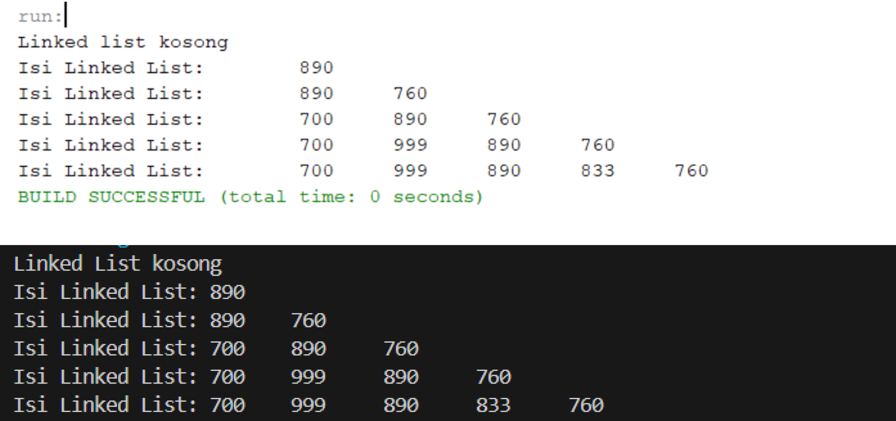
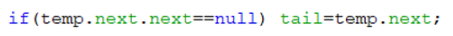
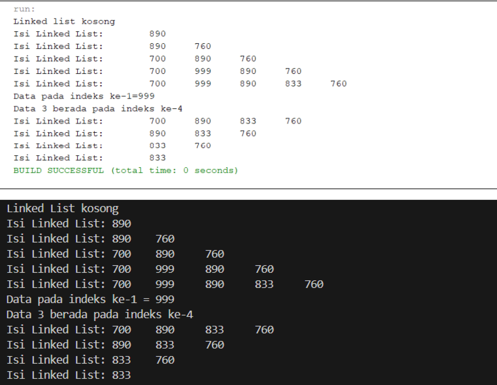
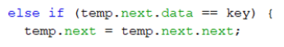
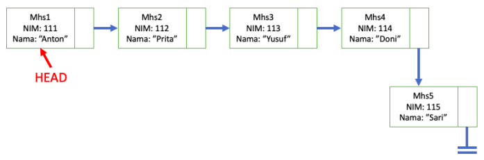
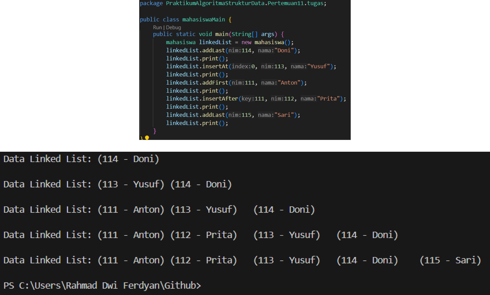
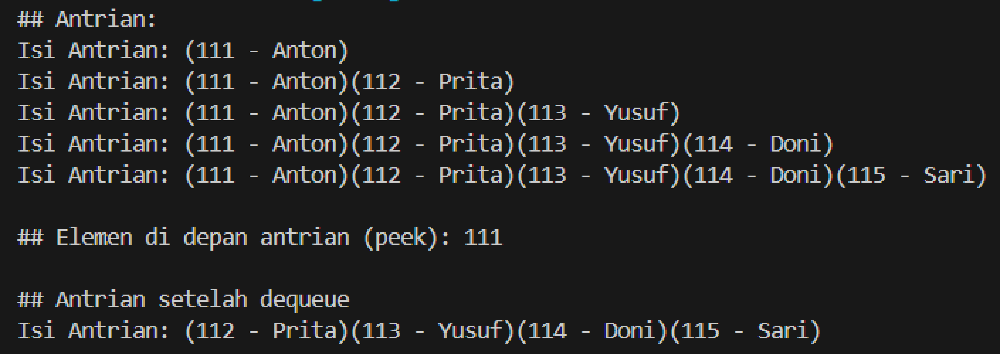

# Laporan Algoritma dan Struktur Data - Jobsheet 9 (LINKED LIST)
Dosen Pengampu : Septian Enggar Sukmana, S.Pd., M.T.  

Nama : Rahmad Dwi Ferdyan  
Kelas : TI-1H  
NIM : 2341720122  
No. Absen : 23  
-
## 2.1 Pembuatan Single Linked List
### 2.1.1 Verifikasi Hasil Percobaan

### 2.1.2 Pertanyaan
1. Mengapa hasil compile kode program di baris pertama menghasilkan “Linked List Kosong”?
> Karena pada class main, program menjalankan method print(); di mana saat itu belum dijalankan method penambahan data, sehingga Linked List/ data masih kosong.
2. Jelaskan kegunaan variable temp secara umum pada setiap method!
> Variabel temp digunakan secara umum sebagai penanda sementara ke node-node dalam linked lis yang mana digunakan untuk melakukan proses penambahan, penghapusan, atau pencarian node dalam linked list tanpa mengganggu pointer utama.
3. Perhatikan class SingleLinkedList, pada method insertAt Jelaskan kegunaan kode berikut   

> Kode program ini berguna untuk memperbarui pointer tail daat sebuah node baru dimasukkan ke akhir linked list.

## 2.2 Modifikasi Elemen pada Single Linked List
### 2.2.2 Verifikasi Hasil Percobaan

### 2.2.3 Pertanyaan
1. Mengapa digunakan keyword break pada fungsi remove? Jelaskan!
> `break` dalam fungsi `remove()` digunakan untuk memastikan bahwa setelah kita menemukan dan menghapus node, tidak akan dilakukan perulangan lagi, dan program akan keluar dari loop agar kode program menjadi lebih efisisen.
2. Jelaskan kegunaan kode dibawah pada method remove

> Kode program tersebut digunakan untuk menemukan node yang ingin dihapus menggunakan `if`, setelah node yang ingin dihapus telah ditemukan, maka akan diatur agar pointer `next` dari node yang sedang diiterasi merujuk ke node setelah node yang akan dihapus (melewati node yang akan dihapus).
_

## 3. Tugas
1. Implementasikan ilustrasi Linked List Berikut. Gunakan 4 macam penambahan data yang telah dipelajari sebelumnya untuk menginputkan data.

> *kode program terlampir dalam folder  

2. Buatlah implementasi program antrian layanan unit kemahasiswaan sesuai dengan kondisi yang
ditunjukkan pada soal nomor 1! Ketentuan
a. Implementasi antrian menggunakan Queue berbasis Linked List!
b. Program merupakan proyek baru, bukan modifikasi dari soal nomor 1!
> *kode program terlampir dalam folder  
