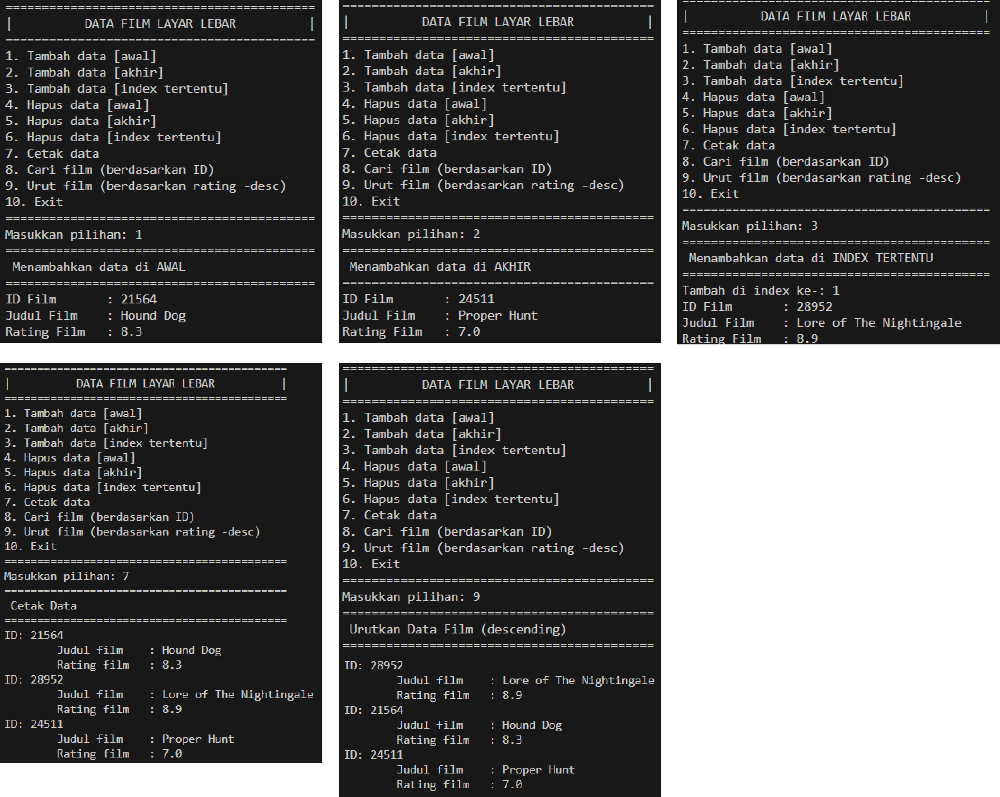

# Laporan Algoritma dan Struktur Data - Jobsheet 10 (DOUBLE LINKED LIST)
Dosen Pengampu : Septian Enggar Sukmana, S.Pd., M.T.  

Nama : Rahmad Dwi Ferdyan  
Kelas : TI-1H  
NIM : 2341720122  
No. Absen : 23  
-
## 12.2 Kegiatan Praktikum 1
### 12.2.2 Verifikasi Hasil Percobaan

### 12.2.3 Pertanyaan Percobaan
1. Jelaskan perbedaan antara single linked list dengan double linked lists!
> Pada Single Linked List:
>- Setiap node  mengandung data dan pointer ke node berikutnya dalam urutan.
>- Referensi dari node terakhir menunjuk ke null, menandakan akhir dari list.
>- Tidak ada cara untuk menelusuri list ke arah belakang dari sebuah node tertentu; Anda hanya bisa bergerak dalam satu arah (maju).  

> Pada Double Linked List:
>- Setiap node dalam double linked list mengandung data, referensi ke node berikutnya (next), dan referensi ke node sebelumnya (prev).
>- pada Double Linked List kita bisa menelusuri list dalam kedua arah (maju dan mundur).

2. Perhatikan class Node, di dalamnya terdapat atribut next dan prev. Untuk apakah atribut tersebut?
> Atribut next adalah pointer yang menunjuk ke node berikutnya dalam linked list, sedangkan atribut prev adalah pointer yang menunjuk ke node sebelumnya dalam linked list.

3. Perhatikan konstruktor pada class DoubleLinkedLists. Apa kegunaan inisialisasi atribut head dan size seperti pada gambar berikut ini?  

> `head` diinisialisasi dengan nilai null yang berarti linked list tersebut masih kosong dan belum ada node yang menjadi kepala dari linked list. Dan `size` diinisialisasi dengan nilai 0 yang berarti pada saat objek `DoubleLinkedLists` pertama kali dibuat, linked list tersebut tidak memiliki elemen apapun.

4. Pada method addFirst(), kenapa dalam pembuatan object dari konstruktor class Node prev dianggap sama dengan null? `Node newNode = new Node(null, item, head);`
> pembuatan object dari konstruktor kelas Node dengan prev dianggap sama dengan null karena node yang ditambahkan akan menjadi node pertama (head) dalam linked list yang mana node pertama (head) pastinya tidak boleh memiliki pointer prev.

5. Perhatikan pada method addFirst(). Apakah arti statement head.prev = newNode?
> Statement tesebut dijalankan saat keadaan head sudah terisi, sehingga ketika kita ingin menambahkan node baru sebagai head, maka newNode ini akan menempati head.prev (yang mana akan mengganti peran head yang lama)

6. Perhatikan isi method addLast(), apa arti dari pembuatan object Node dengan mengisikan parameter prev dengan current, dan next dengan null?
Node newNode = new Node(current, item, null);
> Node baru akan dibuat dengan `prev`nya diset ke current, yang menunjuk ke node terakhir saat ini. `item` diset dengan nilai item yang akan ditambahkan ke node baru. `next` diset ke null karena node baru ini akan menjadi node terakhir dalam linked list, sehingga tidak ada node lagi setelahnya.

7. Pada method add(), terdapat potongan kode program sebagai berikut:
jelaskan maksud dari bagian yang ditandai dengan kotak kuning.  

> kode ini memastikan bahwa ketika sebuah node baru ditambahkan pada indeks 0 atau head (di depan linked list), node tersebut diatur dengan benar sebagai node pertama (head). Node yang awalnya adalah node pertama sekarang menjadi node kedua, dan referensi head diperbarui untuk menunjuk ke node baru.

## 12.3 Kegiatan Praktikum 2
### 12.3.2 Verifikasi Hasil Percobaan

### 12.3.3 Pertanyaan Percobaan
1. Apakah maksud statement berikut pada method removeFirst()?
head = head.next;
head.prev = null;
> Kode ini akan memindahkan atau menggeser posisi head ke node yang ke-2 kemudian menghapus pointer prev dari node ke-2 (yang sekarang menjadi head) menjadi null.

2. Bagaimana cara mendeteksi posisi data ada pada bagian akhir pada method removeLast()?
> Dengan cara perulangan untuk mencari node kedua terakhir (sebelum node terakhir)dalam linked list. Setelah node tersebut ditemukan, kita menghapus referensi dari node kedua terakhir ke node terakhir, sehingga node terakhir dihapus.
3. Jelaskan alasan potongan kode program di bawah ini tidak cocok untuk perintah remove!  

> `tmp` seharusnya dijadikan sebagai node pertama (head) bukan head.next. Dan dengan mengatur head.next ke tmp.next, maka akan melewati node kedua dan langsung menghubungkan node pertama ke node setelahnya. Ini akan menghilangkan node kedua dari linked list, bukan node yang dimaksud.

4. Jelaskan fungsi kode program berikut ini pada fungsi remove!

> Kode ini akan menghubungkan node sebelum dan sesudah node yang dihapus sehingga tidak ada lagi node yang terhubung langsung ke node yang dihapus.

## 12.4 Kegiatan Praktikum 3
### 12.4.3 Verifikasi Hasil Percobaan

### 12.4.3 Pertanyaan Percobaan
1. Jelaskan method size() pada class DoubleLinkedLists!
> Metode size() pada kelas DoubleLinkedLists digunakan untuk mengembalikan jumlah elemen atau berapa node yang ada dalam double linked list pada saat ini.
2. Jelaskan cara mengatur indeks pada double linked lists supaya dapat dimulai dari indeks ke1!
> Caranya adalah dengan memodifikasi beberapa metode, contohnya Metode add(int item, int index): Mengubah logika dalam metode add sehingga ketika kita menambahkan elemen pada indeks ke-1, itu akan menambahkannya sebagai elemen pertama dalam linked list, bukan sebelumnya. Kemudian, saat menambahkan elemen pada indeks ke-2, itu akan dimasukkan di antara elemen pertama dan kedua.
3. Jelaskan perbedaan karakteristik fungsi Add pada Double Linked Lists dan Single Linked Lists!
> Pada double linked lists, setiap node memiliki dua pointer, yaitu prev (pointer ke node sebelumnya) dan next (pointer ke node berikutnya). Saa tmenambahkan elemen baru, kita perlu memperbarui kedua pointer ini untuk menyambungkan node baru dengan node sebelumnya dan node berikutnya. Sedangkan pada single linked lists, setiap node hanya memiliki satu pointer, yaitu next (pointer ke node berikutnya).

4. Jelaskan perbedaan logika dari kedua kode program di bawah ini!

>Potongan kode pertama menggunakan variabel size untuk menentukan apakah linked list kosong atau tidak. Linked list dianggap kosong jika tidak ada elemen yang disimpan di dalamnya yaitu saat size = 0
>Potongan kode kedua menggunakan variabel head untuk menentukan apakah linked list kosong atau tidak. Ini menunjukkan bahwa linked list dianggap kosong jika tidak ada node yang menunjuk ke node pertama (tidak ada head)
-
## 12.5 Tugas Praktikum
1. Buat program antrian vaksinasi menggunakan queue berbasis double linked list sesuai ilustrasi dan menu di bawah ini! (counter jumlah antrian tersisa di menu cetak(3) dan data orang yang telah divaksinasi di menu Hapus Data(2) harus ada)

2. Buatlah program daftar film yang terdiri dari id, judul dan rating menggunakan double linked lists, bentuk program memiliki fitur pencarian melalui ID Film dan pengurutan Rating secara descending. Class Film wajib diimplementasikan dalam soal ini.
