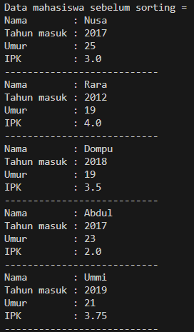
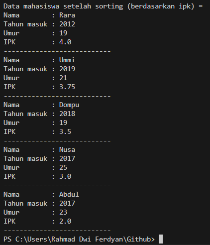
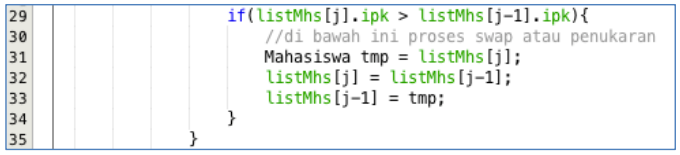
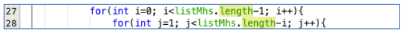
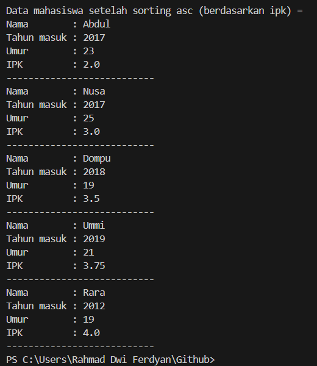
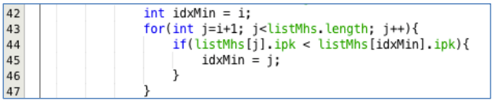
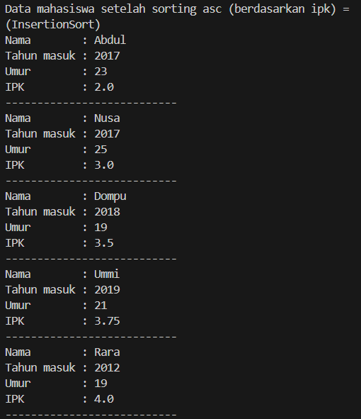
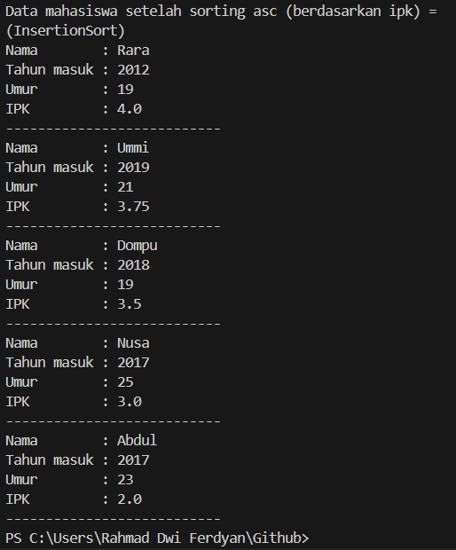
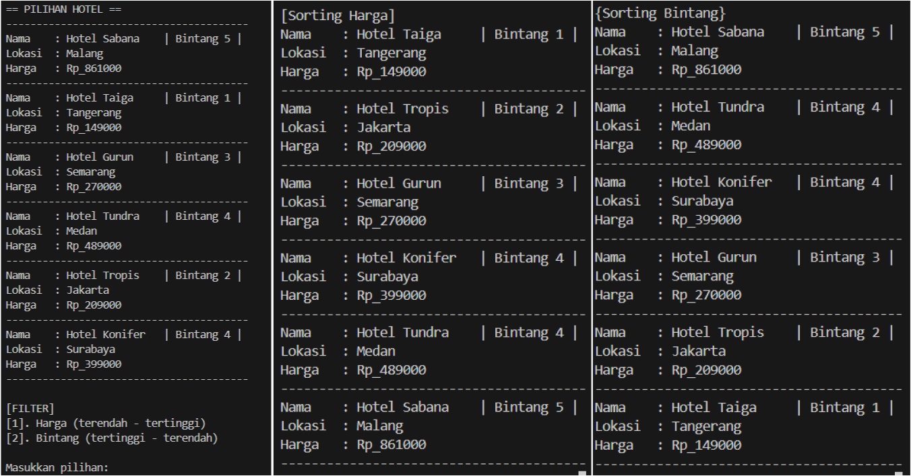

# Laporan Algoritma dan Struktur Data - Jobsheet 5 (Sorting)
Dosen Pengampu : Septian Enggar Sukmana, S.Pd., M.T.  

Nam : Rahmad Dwi Ferdyan  
Kelas: TI-1H  
NIM : 2341720122  
No. Absen : 23  

## 5.2 Mengurutkan Data Mahasiswa Berdasarkan IPK Menggunakan Bubble Sort
### 5.2.1 Langkah-langkah Percobaan
### 5.2.2 Verifikasi Hasil Percobaan
  

### 5.2.3 Pertanyaan
1. Terdapat di method apakah proses bubble sort?
> Di method `bubbleSort()`
2. Di dalam method bubbleSort(), terdapat baris program seperti di bawah ini:

Untuk apakah proses tersebut?
> Proses yang dilakukan pada baris tersebut adalah mengecek apakah nilai IPK di indeks `j` lebih besar dari nilai IPK di indeks `j-1`. Jika kondisi benar, maka akan di-swap antara nilai mahasiswa di indeks `j` dan `j-1`.
3. Perhatikan perulangan di dalam bubbleSort() di bawah ini:


a. Apakah perbedaan antara kegunaan perulangan i dan perulangan j?
> Perulangan `i` digunakan untuk mengatur batas perulangan. Seriap perulangan `i, nilai terbesar akan di-swap ke bagian paling kanan dari array.
Perulangan `j` digunakan untuk membandingkan kemudian menukar nilai yang berdekatan.

b. Mengapa syarat dari perulangan `i` adalah `i<listMhs.length-1` ?
> Karena pada perulanagn terakhir, nilai terbesar sudah di-swap ke posisi yang benar yaitu di ujung kanan array, sehingga pertukaran hanya perlu dilakukan sejumal `j-1`.

c. Mengapa syarat dari perulangan `j` adalah `j<listMhs.length-i` ?
> Karena di setiap perulangan `i`, nilai terbesar paling kanan yang sudah urut, jadi tidak perlu lagi dibandingkan dan di-swap.

d. Jika banyak data di dalam listMhs adalah 50, maka berapakali perulangan i akan berlangsung? Dan ada berapa Tahap bubble sort yang ditempuh?
> Perulangan i akan berlangsung sebanyak 49 kali, begitupula tahapan Bubble Sort-nya, yakni 49 kali.

## 5.3 Mengurutkan Data Mahasiswa Berdasarkan IPK Menggunakan Selection Sort
### 5.3.1. Langkah-langkah Percobaan
### 5.3.2. Verifikasi Hasil Percobaan  

### 5.3.3. Pertanyaan
Di dalam method selection sort, terdapat baris program seperti di bawah ini:

Untuk apakah proses tersebut, jelaskan!
> - Dalam proses ini, variabel `idxMin` digunakan untuk menyimpan indeks dari nilai minimum dari list mahasiswa.  
- Pada baris `int idxMin = i`;, indeks i adalah indeks minimum awalnya.  
- Pada baris `for (int j = i + 1; j < listMhs.length; j++)`, looping dilakukan dari indeks `i + 1` sampai dengan indeks `listMhs.length - 1`  
- Pada baris `if (listMhs[j].ipk < listMhs[idxMin].ipk)`, dilakukan perbandingan antara nilai IPK mahasiswa pada indeks `j` dengan nilai IPK mahasiswa pada indeks `idxMin`. Jika nilai IPK mahasiswa pada indeks j lebih rendah dari nilai IPK mahasiswa pada indeks idxMin, maka indeks j akan digunakan sebagai indeks minimum baru.  
- Proses tersebut dilakukan sampai list mahasiswa terurut.

## 5.4 Mengurutkan Data Mahasiswa Berdasarkan IPK Menggunakan Insertion Sort
### 5.4.1 Langkah-langkah Percobaan
### 5.4.2 Verifikasi Hasil Percobaan

### 5.4.3 Pertanyaan
Ubahlah fungsi pada InsertionSort sehingga fungsi ini dapat melaksanakan proses sorting dengan cara descending.
```
void insertionSort() {
        for (int i = 1; i < listMhs.length; i++) {
            Mahasiswa temp = listMhs[i];
            int j = i;

           while (j > 0 && listMhs[j - 1].ipk < temp.ipk) {     //*perubahan
                
                listMhs[j] = listMhs[j - 1];
                j--;
            }
            listMhs[j] = temp;
        }
    }
```

## 5.5 Latihan Praktikum
Sebuah platform travel yang menyediakan layanan pemesanan kebutuhan travelling sedang mengembangkan backend untuk sistem pemesanan/reservasi akomodasi (penginapan), salah satu fiturnya adalah menampilkan daftar penginapan yang tersedia berdasarkan pilihan filter yang diinginkan user. Daftar penginapan ini harus dapat disorting berdasarkan
1. Harga dimulai dari harga termurah ke harga tertinggi.
2. Rating bintang penginapan dari bintang tertinggi (5) ke terendah (1).
Buatlah proses sorting data untuk kedua filter tersebut dengan menggunakan algoritma bubble sort dan selection sort.    

```
package PraktikumAlgoritmaStrukturData.Pertemuan6.Latihan_Praktikum;

public class HotelService {
    Hotel rooms[] = new Hotel[6];
    int idx;

    void tambah(Hotel H) {
        if (idx < rooms.length) {
            rooms[idx] = H;
            idx++;
        } else {
            System.out.println("Data sudah penuh!");
        }
    }

    void tampilAll() {
        for (Hotel h : rooms) {
            h.tampilAll();
            System.out.println("----------------------------------------");
        }
    }

    void bubbleSort() {
        for (int i = 0; i < rooms.length - 1; i++) {
            for (int j = 1; j < rooms.length - i; j++) {
                if (rooms[j].bintang > rooms[j - 1].bintang) {
                    Hotel tmp = rooms[j];
                    rooms[j] = rooms[j - 1];
                    rooms[j - 1] = tmp;
                }
            }
        }
    }

    void selectionSort() {
        for (int i = 0; i < rooms.length - 1; i++) {
            int idxMin = i;
            for (int j = i + 1; j < rooms.length; j++) {
                if (rooms[j].harga < rooms[idxMin].harga) {
                    idxMin = j;
                }
            }
            Hotel tmp = rooms[idxMin];
            rooms[idxMin] = rooms[i];
            rooms[i] = tmp;
        }
    }

}
```

`selengkapnya dapat dilihat di folder Latihan_Praktikum`