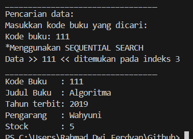

# Laporan Algoritma dan Struktur Data - Jobsheet 6 (Searching)
Dosen Pengampu : Septian Enggar Sukmana, S.Pd., M.T.  

Nam : Rahmad Dwi Ferdyan  
Kelas: TI-1H  
NIM : 2341720122  
No. Absen : 23  

## 6.2. Searching / Pencarian Menggunakan Agoritma Sequential Search
### 6.2.1. Langkah-langkah Percobaan Sequential Search
### 6.2.2. Verifikasi Hasil Percobaan


> Hasil  :  


### 6.2.3. Pertanyaan
1. Jelaskan fungsi break yang ada pada method FindSeqSearch! 
> Pada method `findSeqSearch`, break digunakan untuk menghentikan perulangan setelah ditemukan nilai yang sesuai dengan nilai variabel`cari`.

2. Jika Data Kode Buku yang dimasukkan tidak terurut dari kecil ke besar. Apakah program masih dapat berjalan? Apakah hasil yang dikeluarkan benar? Tunjukkan hasil screenshoot untuk bukti dengan kode Buku yang acak. Jelaskan Mengapa hal tersebut bisa terjadi?
>  Hal tersebut disebabkan oleh kemampuan Sequential Search untuk membandingkan nilai satu per satu hingga ditemukan nilai yang dicari, sehingga data tidak perlu urut.
    

3. Buat method baru dengan nama FindBuku menggunakan konsep sequential search dengan tipe method dari FindBuku adalah BukuNoAbsen. Sehingga Anda bisa memanggil method tersebut pada class BukuMain seperti gambar berikut :  


## 6.3. Searching / Pencarian Menggunakan Binary Search
### 6.3.1. Langkah-langkah Percobaan Binary Search
### 6.3.2. Verifikasi Hasil Percobaan

> Hasil  :  


### 6.3.3. Pertanyaan
1. Tunjukkan pada kode program yang mana proses divide dijalankan!  
```
if (left <= right) {
    mid = (left + right) / 2
```
2. Tunjukkan pada kode program yang mana proses conquer dijalankan!
```
if (listBk[mid].kodeBuku > cari)
            return FindBinarySearch(cari, left, mid - 1);
        return FindBinarySearch(cari, mid + 1, right); 
```
4. Jika data Kode Buku yang dimasukkan tidak urut. Apakah program masih dapat berjalan? Mengapa demikian! Tunjukkan hasil screenshoot untuk bukti dengan kode Buku yang acak. Jelaskan Mengapa hal tersebut bisa terjadi?
> Binary membagi pencarian menjadi dua bagian setiap kali  pencarian dilakukan. Jika data tidak diurutkan, tidak mungkin untuk menentukan apakah elemen yang dicari berada di bagian kiri atau kanan dari elemen tengah saat membagi array jadi dua.  

3. Jika Kode Buku yang dimasukkan dari Kode Buku terbesar ke terkecil (missal : 20215, 20214, 20212, 20211, 20210) dan elemen yang dicari adalah 20210. Bagaimana hasil dari binary search? Apakah sesuai? Jika tidak sesuai maka ubahlah kode program binary seach agar hasilnya sesuai!  
> Hasil tidak sesuai, kode diubah sebagai berikut:
```
if (listBk[mid].kodeBuku > cari) {
                return FindBinarySearch(cari, mid+1, right);
            }
                return FindBinarySearch(cari, left, mid-1);
        }
        return -1;
```
>

## 6.4. Percobaan Pengayaan Divide and Conquer
### 6.4.1. Langkah-langkah Percobaan Merge Sort
### 6.4.2. Verifikasi Hasil Percobaan

> Hasil :  


## 6.5. Latihan Praktikum
1. Modifikasi percobaan searching diatas dengan ketentuan berikut ini
- Ubah tipe data dari kode Buku yang awalnya int menjadi String
- Tambahkan method untuk pencarian kode Buku (bertipe data String) dengan menggunakan
sequential search dan binary search.
```
public int findSeqSearch(String cari) {
        int posisi = -1;
        for (int j = 0; j < listBk.length; j++) {
            if (listBk[j].kodeBuku.equals(cari)) {
                posisi = j;
                break;
            }
        }
        return posisi;
    }

    public int FindBinarySearch(String cari, int left, int right) {
        if (left <= right) {
            int mid = (left + right) / 2;
            int num = Integer.parseInt(listBk[mid].kodeBuku);
            int num1 = Integer.parseInt(cari);

            if (num == num1) {
                return mid;
            }

            if (num < num1) {

                return FindBinarySearch(cari, mid + 1, right);
            } else {

                return FindBinarySearch(cari, left, mid - 1);
            }
        }

        return -1;
    }
```

2. Modifikasi percobaan searching diatas dengan ketentuan berikut ini
- Tambahkan method pencarian judul buku menggunakan sequential search dan binary search. Sebelum dilakukan searching dengan binary search data harus dilakukan pengurutan dengan menggunakan algoritma Sorting (bebas pilih algoritma sorting apapun)! Sehingga ketika input data acak, maka algoritma searching akan tetap berjalan
- Buat aturan untuk mendeteksi hasil pencarian judul buku yang lebih dari 1 hasil dalam bentuk kalimat peringatan! Pastikan algoritma yang diterapkan sesuai dengan kasus yang diberikan!

```
public int[] findSeqSearchByTitle(String cariJudul) {
        int[] positions = new int[listBk.length];
        int count = 0;
        for (int j = 0; j < listBk.length; j++) {
            if (listBk[j].judulBuku.equalsIgnoreCase(cariJudul)) {
                positions[count++] = j;
            }
        }
        int[] result = new int[count];
        for (int i = 0; i < count; i++) {
            result[i] = positions[i];
        }
        return result;
    }
    public int[] findBinarySearchByTitle(String cariJudul, int left, int right) {
        int mid;
        if (left <= right) {
            mid = (left + right) / 2;
            int comparisonResult = listBk[mid].judulBuku.compareToIgnoreCase(cariJudul);
            if (comparisonResult == 0) {
                return new int[] { mid };
            } else if (comparisonResult < 0) {
                return findBinarySearchByTitle(cariJudul, mid + 1, right);
            } else {
                return findBinarySearchByTitle(cariJudul, left, mid - 1);
            }
        }
        return new int[0];
    }

    public void mergeSort() {
        mergeSort(0, idx - 1);
    }

    private void mergeSort(int left, int right) {
        if (left < right) {
            int mid = (left + right) / 2;
            mergeSort(left, mid);
            mergeSort(mid + 1, right);
            merge(left, mid, right);
        }
    }

    private void merge(int left, int mid, int right) {
        int n1 = mid - left + 1;
        int n2 = right - mid;
        Buku23[] L = new Buku23[n1];
        Buku23[] R = new Buku23[n2];
        for (int i = 0; i < n1; ++i) {
            L[i] = listBk[left + i];
        }
        for (int j = 0; j < n2; ++j) {
            R[j] = listBk[mid + 1 + j];
        }
        int i = 0, j = 0;
        int k = left;
        while (i < n1 && j < n2) {
            if (L[i].judulBuku.compareToIgnoreCase(R[j].judulBuku) <= 0) {
                listBk[k] = L[i];
                i++;
            } else {
                listBk[k] = R[j];
                j++;
            }
            k++;
        }
        while (i < n1) {
            listBk[k] = L[i];
            i++;
            k++;
        }
        while (j < n2) {
            listBk[k] = R[j];
            j++;
            k++;
        }
    }
```
> 