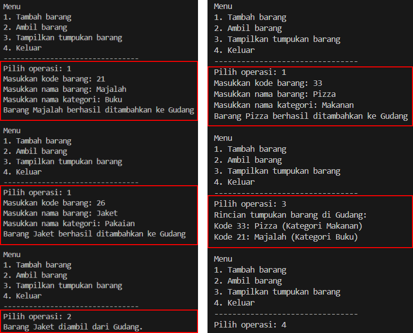

# Laporan Algoritma dan Struktur Data - Jobsheet 7 (Stack)
Dosen Pengampu : Septian Enggar Sukmana, S.Pd., M.T.  

Nam : Rahmad Dwi Ferdyan  
Kelas: TI-1H  
NIM : 2341720122  
No. Absen : 23  
-

## 2.1 Percobaan 1: Penyimpanan Tumpukan Barang dalam Gudang
### 2.1.2 Verifikasi Hasil Percobaan

### 2.1.3 Pertanyaan
1. Lakukan perbaikan pada kode program, sehingga keluaran yang dihasilkan sama dengan verifikasi
hasil percobaan! Bagian mana saja yang perlu diperbaiki?
2. Berapa banyak data barang yang dapat ditampung di dalam tumpukan? Tunjukkan potongan kode
programnya!
> `Gudang23 gudang = new Gudang23(7);` Terdapat 7 data barang yang dapat ditampung.
3. Mengapa perlu pengecekan kondisi !cekKosong() pada method tampilkanBarang? Kalau kondisi
tersebut dihapus, apa dampaknya?
> Pengecekan kondisi !cekKosong() dilakukan untuk mengecek apakah barang pada gudang kosong atau tidak sebelum menampilkan dafta data barang. Jika dihapus, maka program akan tetap mencoba menampilkan daftar barang meskipun jika data gudang kosong, hal ini dapat memberikan output yang tidak relevan.
4. Modifikasi kode program pada class Utama sehingga pengguna juga dapat memilih operasi lihat
barang teratas, serta dapat secara bebas menentukan kapasitas gudang!

5. Commit dan push kode program ke Github

## 2.2 Percobaan 2: Konversi Kode Barang ke Biner 
### 2.2.2 Verifikasi Hasil Percobaan

### 2.2.3 Pertanyaan
1. Pada method `konversiDesimalKeBiner`, ubah kondisi perulangan menjadi while (kode != 0), bagaimana hasilnya? Jelaskan alasannya!
> Hasilnya akan tetap sama/ tidak ada yang berubah. Karena algoritma/ logika pada while (kode>0) dan while (kode!=0), pada dasarnya memiliki logika yang setara atau tujuan yang sama.
2. Jelaskan alur kerja dari method konversiDesimalKeBiner!
> Ketika dimasukkan sebuah nilai, method ini akan membagi nilai tersebut dengan 2 dan menyimpan sisa bagi (modulus) pada setiap perulangan. Karena sifat stack LIFO (Last In, First Out), maka dari itu sisa-sisa ini kemudian disusun secara terbalik dalam sebuah stack. Setelah semua sisa telah dimasukkan, method akan mengembalikan string biner.

## 2.3 Percobaan 3: Konversi Notasi Infix ke Postfix
### 2.3.2 Verifikasi Hasil Percobaan

### 2.3.3 Pertanyaan
1. Pada method derajat, mengapa return value beberapa case bernilai sama? Apabila return value diubah dengan nilai berbeda-beda setiap case-nya, apa yang terjadi?
> Dalam method derajat, beberapa case memiliki return value yang sama karena operator-operator tersebut memiliki tingkat prioritas yang sama. 
Jika return value dari setiap case dibuat berbeda semua, maka akan terjadi perubahan dalam konversi infix ke postfix, dan juga akan menghasikan urutan evaluasi yang berbeda dalam hasilnya.
2. Jelaskan alur kerja method konversi!
> Method konversi akan melakukan perulangan untuk setiap karakter dalam ekspresi infix untuk dicek. Jika karakter tersebut adalah operand, maka langsung dimasukkan ke dalam ekspresi postfix yang dihasilkan. Jika itu tanda kurung buka, maka dimasukkan ke dalam stack. Jika itu adalah tanda kurung tutup, maka operator-operator dalam stack dipindahkan ke ekspresi postfix hingga menemukan tanda kurung buka yang sesuai. Jika itu adalah operator, maka dilakukan pengecekan prioritasnya dengan operator yang ada di stack. Operator-operator dengan prioritas lebih tinggi atau sama akan dipindahkan ke ekspresi postfix, sementara operator saat ini akan dipush ke dalam stack. Setelah iterasi selesai, semua operator yang tersisa di stack dipindahkan ke ekspresi postfix. Akhirnya, ekspresi postfix yang dihasilkan dikembalikan. 

3. Pada method konversi, apa fungsi dari potongan kode berikut?

> Kode `c = Q.charAt(i);` berfungsi untuk mengambil karakter pada posisi i dari string Q dan menyimpannya dalam variabel c. Variabel c mewakili karakter saat ini yang sedang diproses dalam infix yang akan dikonversi menjadi postfix. 

## 2.4 Latihan Praktikum
Perhatikan dan gunakan kembali kode program pada Percobaan 1. Tambahkan dua method berikut
pada class Gudang:
• Method lihatBarangTerbawah digunakan untuk mengecek barang pada tumpukan terbawah
• Method cariBarang digunakan untuk mencari ada atau tidaknya barang berdasarkan kode barangnya atau nama barangnya

